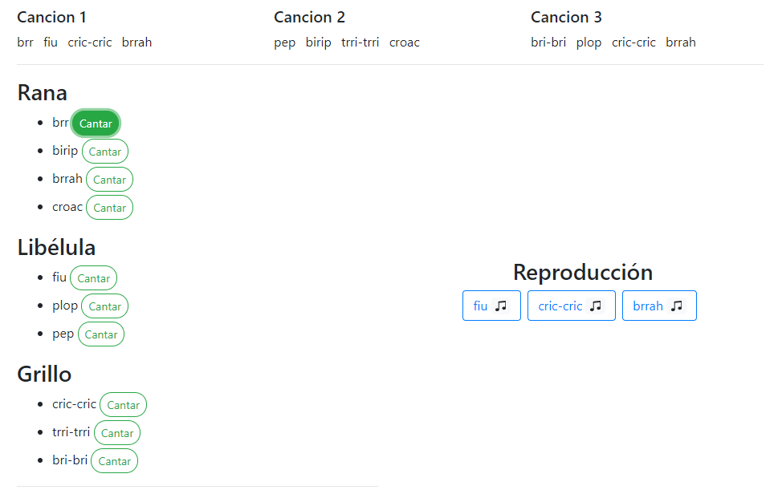

# Resolución Ejercicio "Lago Musical"

Clic en los botones según el sonido para continuar con la canción que corresponde, se va a reproducir durante 3 segundos.

## Captura del programa web


## Project setup
```
npm install
```

### Compiles and hot-reloads for development
```
npm run serve
```

### Compiles and minifies for production
```
npm run build
```

### Lints and fixes files
```
npm run lint
```

### Customize configuration
See [Configuration Reference](https://cli.vuejs.org/config/).
